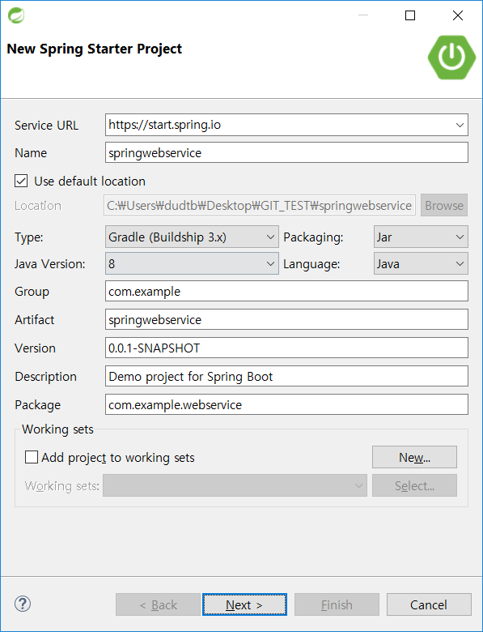
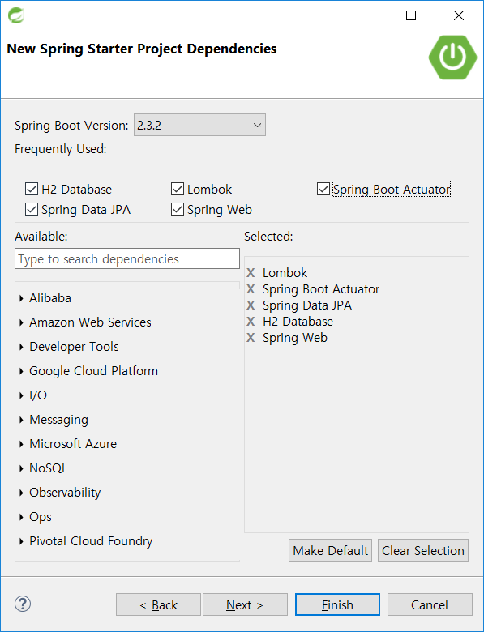
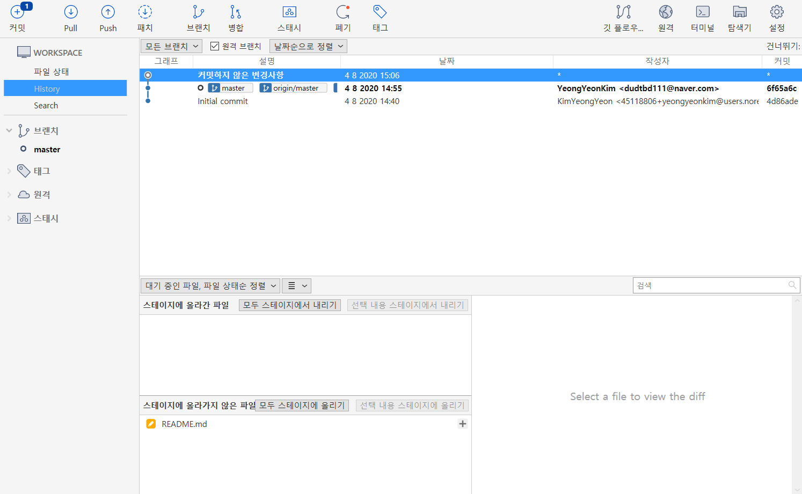

# SpringWebservice

##### # 08/03 

IntelliJ에서 스프링부트는 Spring Initializr을 선택.

Spring Boot는 Spring Starter를 선택한다.

빌드 툴은 Gradle을 사용한다.

Gradle은 Maven보다 빌드속도가 대폭 개선되었고, 다양한 Task를 쉽게 생성가능해서

많은 프로젝트에서 도입중이다.

- Core의 Lombok

- Web의 Web

- SQL의 JPA, H2

- OPS의 Actuators

  을 선택한다.
  
  

------------------

##### # 08/04

보통 SI 프로젝트에선 SVN을 많이 사용하는데,

개인 프로젝트나 자사 서비스를 운영하는 곳에선 대부분 Git으로 코드관리를 한다.

Git은 DVCS로 **코드 관리를 로컬저장소와 원격저장소 양쪽에서 관리**할 수 있는 장점.

(SVN은 원격저장소밖에 없다.)

굳이 코드 관리용 서버를 구축할 필요 없이 Github를 사용하면 바로 원격 저장소를 사용 가능.

Git + Source Tree를 사용.

--------------

##### # 08/07

약간 참고 자료를 바꿔서 '스프링 부트로 배우는 자바 웹 개발' 책을 보고 공부를 하겠다.

### **스프링 부트**

설정 자동화(AutoConfigure)를 이용해서 
스프링 MVC 모듈의 DispathcerServlet 설정, JDBC DataSource 설정 등 
웹 개발을 하는 데 필요한 인프라성 코드들을 제공해 줌으로써 
복잡한 XML 설정을 하지 않아도 개발을 시작할 수 있다.
또한, 실행 시에도 임베디드 톰캣을 이용해 main 메서드로 실행할 수 있다.
그리고 클라우드 환경에서도 별도의 작업 없이 스프링 부트를 이용하면 시간을 많이 단축 가능하다.

### **웹 애플리케이션 컨테이너**

웹 애플리케이션이 배포되는 공간을 뜻한다.
일반적으로 HTML 같은 **정적** 파일들을 전달해 주는 역할을 하는 서버를 **웹 서버**,
PHP, JSP, ASP와 같은 언어들로 **동적**인 페이지를 생성하는 서버를 **웹 애플리케이션 서버** 또는
웹 애플리케이션 컨테이너라고 하며, **WAS**로 줄여서 부르기도 한다.

### JAR WAR

* 공통 : 애플리케이션을 쉽게 배포하고 동작시킬 수 있도록 관련 파일들을 패키징하는 것.
* 차이 
  * JAR : class와 같은 java 리소스, 라이브러리 등이 포함된 **자바 프로젝트를 압축한 파일**.
  * WAR : servlet / jsp 컨테이너에 배치 할 수 있는 **웹 애플리케이션 압축 파일 포맷**.
    jsp, servlet, jar, class, xml, html, javascript 등 servlet context 관련 파일들로 패키징.
    **웹 관련 자원만 포함하고 있으며 이를 사용하면 웹 앱을 쉽게 배포**하고 테스트 가능.

### JVM JRE JDK

JVM : 자바프로그램 등을 컴파일하여 만들어진 바이트 코드를 실행해주는 가상머신

JRE : JVM + 클래스 로더(올바르게 클래스를 로드해 코어 자바 클래스 **라이브러리**에 연결)

​		자바 프로그램을 실행시켜주는 환경을 구성해주는 도구. (개발 없이 실행만 필요할 경우도 가능)

JDK : JRE + Development Tools

​		자바 개발시 필요한 툴킷을 제공하는 도구 모음. (개발을 위해서)

-----------

##### # 08/08

### Servlet

클라이언트의 요청을 처리하고 그 결과를 다시 클라이언트에게 전송하는 자바 프로그래밍 기술

**[특징]**

* 클라이언트의 요청에 대해 동적으로 작동하는 웹 어플리케이션 컴포넌트
* html을 사용하여 요청에 응답한다.
* Java Thread를 이용하여 동작한다.
* MVC 패턴에서 Controller로 이용된다.
* HTTP 프로토콜 서비스를 지원하는 javax.servlet.http.HttpServlet 클래스를 상속받는다. UDP보다 속도가 느리다.

**[Servlet 동작 방식]**

1. 사용자(클라이언트)가 URL을 클릭하면 HTTP Request를 Servlet Container로 전송합니다.
2. HTTP Request를 전송받은 Servlet Container는 HttpServletRequest, HttpServletResponse 두 객체를 생성합니다.
3. web.xml은 사용자가 요청한 URL을 분석하여 어느 서블릿에 대해 요청을 한 것인지 찾습니다.
4. 해당 서블릿에서 service메소드를 호출한 후 클리아언트의 POST, GET여부에 따라 doGet() 또는 doPost()를 호출합니다.
5. doGet() or doPost() 메소드는 동적 페이지를 생성한 후 HttpServletResponse객체에 응답을 보냅니다.
6. 응답이 끝나면 HttpServletRequest, HttpServletResponse 두 객체를 소멸시킵니다.

### Servlet Container

JSP, 서블릿이 웹서버가 통신할 수 있도록 소켓을 만들어 통신. 대표적으로 톰켓.

  **1. 웹서버와의 통신 지원**

서블릿 컨테이너는 서블릿과 웹서버가 손쉽게 통신할 수 있게 해줍니다.
일반적으로 우리는 소켓을 만들고 listen, accept 등을 해야하지만 
서블릿 컨테이너는 이러한 기능을 API로 제공하여 복잡한 과정을 생략할 수 있게 해줍니다.

  **2. 서블릿 생명주기(Life Cycle) 관리** 

  **3. 멀티쓰레드 지원 및 관리**

  **4. 선언적인 보안 관리** 

### JSP

Java 코드가 들어가있는 HTML 코드 <% 소스코드 %> 또는 <%= 소스코드 =%>형태

JSP는 WAS에 의해 서블릿 클래스로 변환하여 사용된다.

file.jsp - (서블릿변환) > file_jsp.java - (컴파일) > file_jsp.class -> Servlet Object

Servlet만 사용하여 웹 페이지를 보여주려면 out 객체의 println 메소드를 사용하여 HTML 문서를 작성해야 하는데 이는 추가/수정을 어렵게 하고, 가독성도 떨어지기 때문에 JSP를 사용하여 비지니스 로직과 프레젠테이션 로직을 분리한다.

